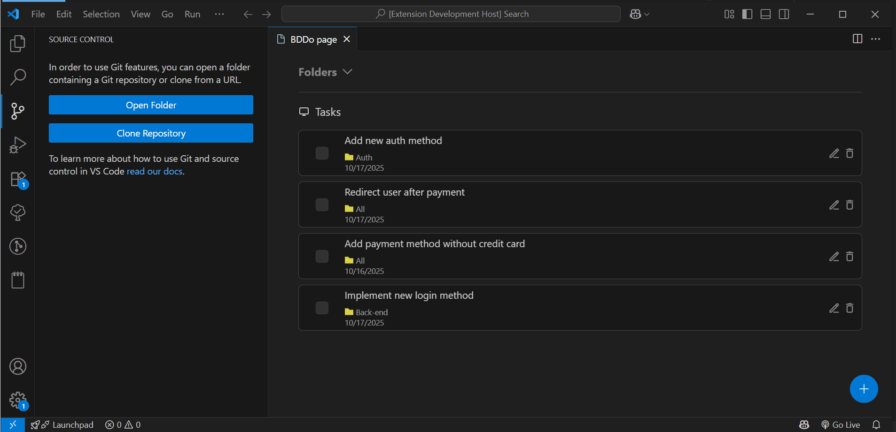

# BDDo

A VSCode extension for managing development tasks using Gherkin syntax (BDD - Behavior-Driven Development).


## 🎯 Overview

BDDo helps developers organize their tasks and test scenarios using an inspired version of the Given-When-Then syntax from Behavior-Driven Development. Manage your features, tasks, and test cases directly within VSCode.





## ✨ Features

### Current Implementation

- **📁 Project Management**

  - Create and delete folders
  - Hierarchical organization of tasks

- **✅ Task Management**

  - Create, update, and delete tasks
  - Associate tasks with projects or keep them standalone

- **🧪 Scenario Definition**

  - Add, update, and delete scenarios for each task
  - Use an inspired Gherkin syntax (given, expected)
  - Categorize scenarios:
    - Happy Path
    - Edge Cases
    - Error Handling

- **🎨 User Interface**
  - Clean, intuitive graphical interface
  - Built with React for smooth interactions
  - Integrated directly into VSCode

## 🛠️ Tech Stack

- **Frontend**: React 18
- **Language**: TypeScript
- **Platform**: VSCode Extension API

## 🚀 Installation

### Development Mode

1. Clone the repository:

```bash
git clone https://github.com/cberkane/bddo.git
cd bddo
```

2. Install dependencies:

```bash
npm install
```

3. Launch in VSCode debugger:

   - Press `F5` or use the Debug panel
   - Select "Launch Extension"

4. Open BDDo:
   - Press `Cmd+Shift+P` (Mac) or `Ctrl+Shift+P` (Windows/Linux)
   - Type: `BDDo: open`

### Marketplace Installation

_Coming soon - Extension will be published to VSCode Marketplace_

## 📖 Usage

### Creating a Project

1. Open BDDo (`Cmd/Ctrl+Shift+P` → `BDDo: open`)
2. Switch to the "Folder" view
3. Enter folder name

### Adding Tasks

1. Open BDDo (`Cmd/Ctrl+Shift+P` → `BDDo: open`)
2. Click on the "Plus" icon to add a new task
3. Define task details

### Defining Scenarios

1. Click on a task to open its details
2. Add scenarios
3. Categorize each scenario (Happy Path, Edge Case, Error)

Example:

```gherkin inspired
Feature: User Login
Scenario: Successful login
Type: Happy Path
Given: User is authenticated. User clicks on login button
Expected: User is redirected to the dashboard
```

## 🗺️ Roadmap

### Planned Features

- [ ] **Drag & Drop**: Reorder features and scenarios
- [ ] **Advanced Filtering**: Filter by project, category, or status
- [ ] **Rich Metadata**:
  - Task complexity indicators
  - GitHub issue links
  - Priority levels
- [ ] **Testing**: Unit and integration tests
- [ ] **Export**: Generate test documentation
- [ ] **Marketplace Publication**: Easy installation for all users

## 🤝 Contributing

Contributions are welcome! Feel free to:

- Report bugs
- Suggest features
- Submit pull requests

## 👤 Author

Chihab Berkane - [GitHub](https://github.com/cberkane)

---

**Note**: BDDo is actively developed. Features and documentation are continuously updated.
